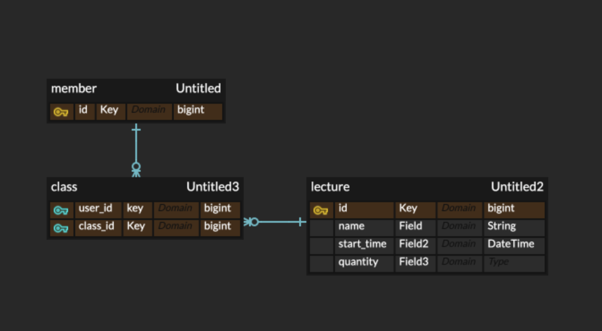

# 특강 신청 서비스 

ERD


quantity -> lock 용도 

## API 명세서
1. 특강 신청 API   
`POST /class?id={id}`  
### HEADER 
AUTHORIZATION={USERID}  
### Response
```json
{
  "statusCode": 200, (or 403),
  "result": "OK", (or FAIL),
  "message": "", (or 인원수 제한 입니다)
}
```

2. 특강 신청 완료 여부 조회 API  
`GET /status?lectureId={lectureId}&member_id={memberId}`

### Response
```json
{
  "statusCode": 200,
  "result": "OK", (or FALSE),
  "message": "", 
}
```

1. controller
- ...
2. service
- ...